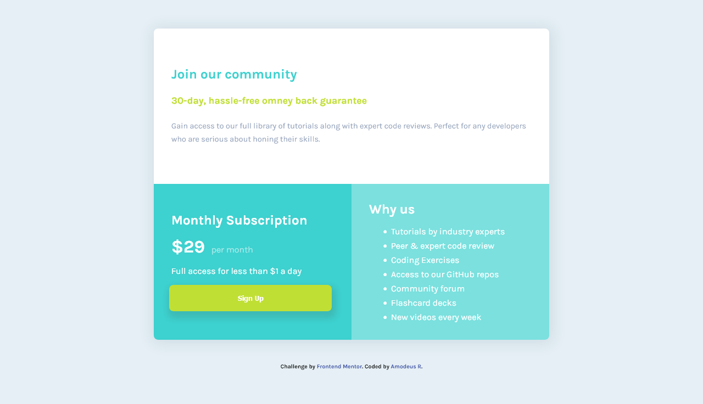

<!-- markdownlint-disable MD033 -->
<h1 align="center">Frontend Mentor - Single price grid component</h1>

This is a solution to the <a href="https://www.frontendmentor.io/challenges/single-price-grid-component-5ce41129d0ff452fec5abbbc">Single price grid component challenge on Frontend Mentor</a>.

<h3 align="center">Languages</h3>

  <a href="#">English</a> • <a href="./lang/README.pt-br.md">Português</a>

<!-- markdownlint-enable MD033 -->

## Table of contents

- [Overview](#overview)
  - [The challenge](#the-challenge)
  - [Screenshots](#screenshots)
  - [Links](#links)
- [My process](#my-process)
  - [Built with](#built-with)
  - [What I learned](#what-i-learned)
- [Author](#author)

## Overview

### The challenge

- list challenges

### Screenshots

| Desktop View (1280px) | iPad View (768px) | iPhone View (375px)|
|-------|-------|-------|
||||

### Links

- Live Site URL: [Github Pages](https://amodeusr.github.io/FM--single-price-grid-component)

## My process

### Built with

- Semantic HTML5 markup
- CSS custom properties
- Flexbox
- CSS Grid
- Mobile-first workflow
- Vanilla Javascript

### What I learned

Describe what you learned

## Author

- Github - [@AmodeusR](https://github.com/amodeusr)
- Linkedin - [@AmodeusR](https://www.linkedin.com/in/AmodeusR)
- Frontend Mentor - [@AmodeusR](https://www.frontendmentor.io/profile/AmodeusR)
