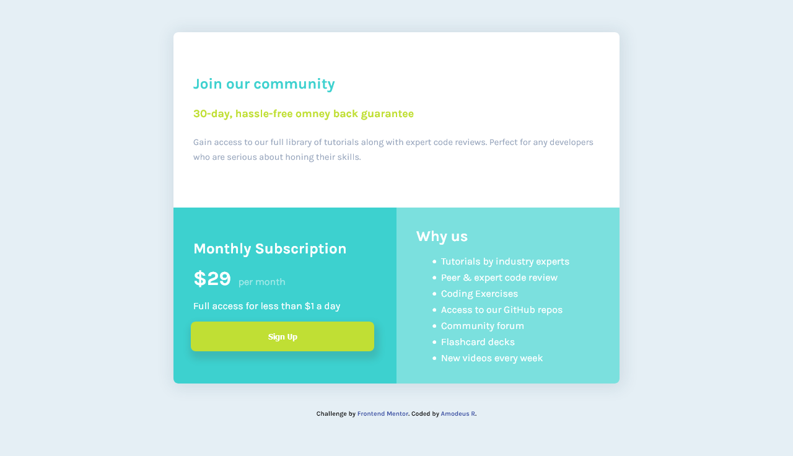
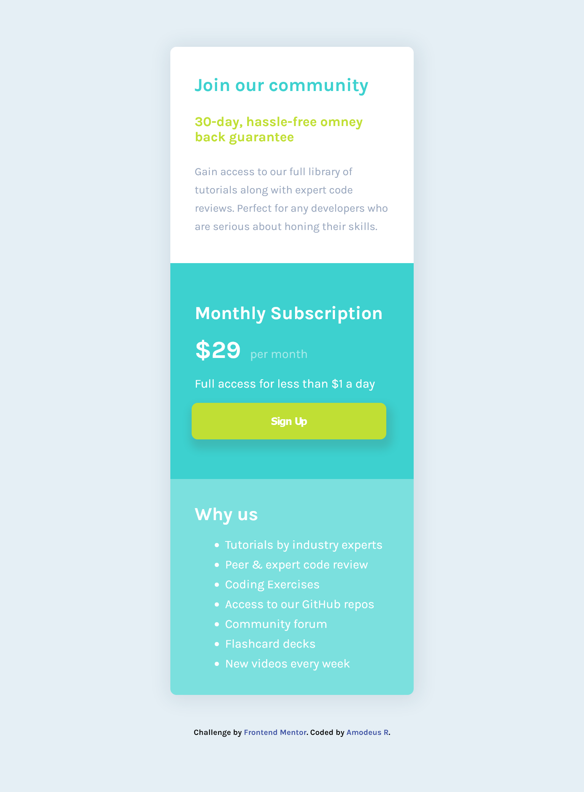

<!-- markdownlint-disable MD033 -->
<h1 align="center">Frontend Mentor - Component grid de preço</h1>

Esta é uma resolução ao <a href="https://www.frontendmentor.io/challenges/single-price-grid-component-5ce41129d0ff452fec5abbbc">desafio Componente grid de preço por Frontend Mentor</a>.

<h3 align="center">Idiomas</h3>

  <a href="../README.md">English</a> • <a href="#">Português</a>

<!-- markdownlint-enable MD033 -->

## Índice

- [Visão Geral](#visão-geral)
  - [O desafio](#o-desafio)
  - [Capturas de tela](#capturas-de-tela)
  - [Links](#links)
- [Meu processo](#meu-processo)
  - [Desenvolvido com...](#desenvolvido-com)
- [Autor](#autor)

## Visão geral

### O desafio

- Exibir o layout ideal para o usuário dependendo do tamanho da tela do seu dispositivo.
- Exibir um hover state no Desktop para o botão de registro.

### Capturas de tela

| Tela Desktop (1280px) | Tela iPad (768px) | Tela iPhone (375px) |
|-------|-------|-------|
||||

### Links

- URL para o Site: [Github Pages](https://amodeusr.github.io/FM--single-price-grid-component)

## Meu processo

### Desenvolvido com...

- Abordagem mobile-first
- CSS Grid
- Flexbox
- Sass

## Autor

- Github - [@AmodeusR](https://github.com/amodeusr)
- Linkedin - [@AmodeusR](https://www.linkedin.com/in/AmodeusR)
- Frontend Mentor - [@AmodeusR](https://www.frontendmentor.io/profile/AmodeusR)
